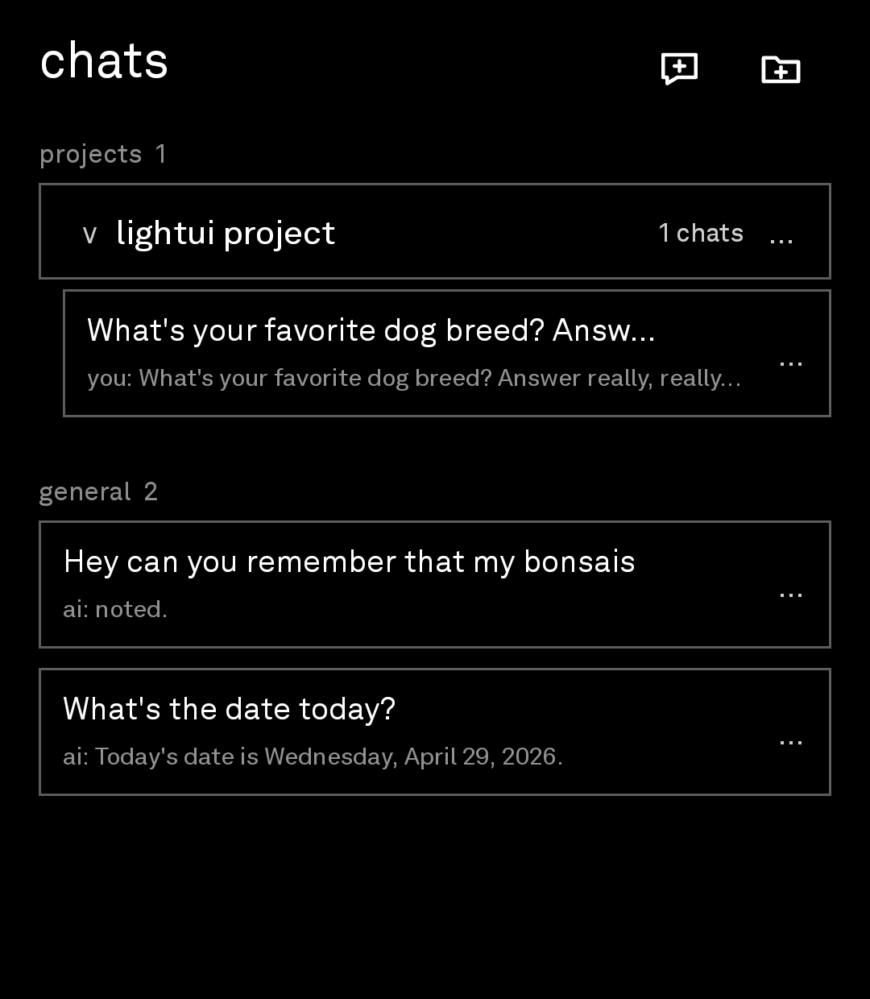
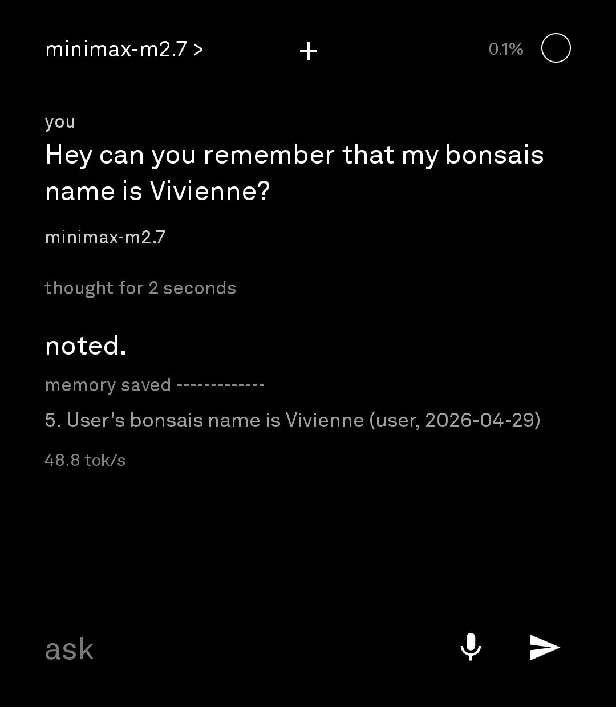
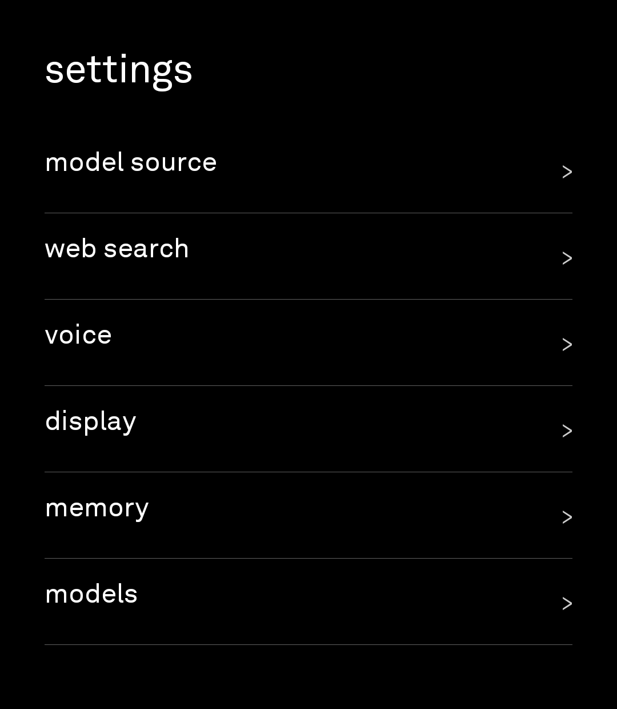

# lightui

Minimal black-and-white lightOS style Android chat client built for small Android devices (specifically for my use case in the Light Phone III). It talks to OpenRouter or OpenAI-compatible endpoints, supports voice, web search, persistent memory, projects, and project-specific instructions.

## Features

- OpenRouter and custom OpenAI-compatible chat endpoints
- Streaming chat with reasoning/thinking display when supported
- Per-chat web search tooling with Jina or Brave
- Persistent `MEMORY.md` user memory with in-app edit/wipe controls
- Project-based instructions injected privately into chats in that project
- Local chat/project history stored on device
- STT/TTS voice flows with endpoint/OpenRouter support
- Android assistant/voice-command overlay support
- Pure black/white UI designed around compact screens

## Screenshots

| Assistant | Chats |
| --- | --- |
|  |  |

| Memory | Settings |
| --- | --- |
|  |  |

## Install

Download `release/lightui-release.apk` from this package or build it yourself.

On a connected Android device:

```powershell
adb install -r release\lightui-release.apk
```

First launch setup:

- Open `settings > model source`.
- Add an OpenRouter API key, or add a custom OpenAI-compatible endpoint.
- Refresh/select models under `settings > models`.
- Optional: configure `settings > web search`, `settings > voice`, and `settings > memory`.

No API keys or personal data are bundled in the APK. Keys, chats, memory, and projects are stored only in the app's private data on the user's device.

## Build

Requirements:

- Android SDK with platform `android-34`
- Android build-tools `34.0.0`
- JDK 11 or newer
- `ANDROID_HOME` or `ANDROID_SDK_ROOT` set

Build from the project root in PowerShell:

```powershell
.\build.ps1
```

The signed installable APK is written to:

```text
build\lightui-release.apk
```

The build script signs with the local Android debug keystore in `%USERPROFILE%\.android\debug.keystore` if no keystore exists. That is fine for sideload testing and GitHub APK downloads, but use your own private release keystore if you need long-term production signing.

## Privacy

- API keys are entered by each user in the app.
- Memory is stored as app-private `MEMORY.md` and can be edited or wiped in `settings > memory`.
- Project instructions are stored locally and injected privately as system context for chats in that project.
- Chat history is stored locally in app private storage.
- Web search requests go to the selected provider only when enabled or required by project/voice settings.

## Assistant Intents

The app exposes an assistant overlay activity for Android assistant/voice-command integrations:

- `android.intent.action.ASSIST`
- `android.intent.action.VOICE_COMMAND`

The main activity can also receive shared text through Android `ACTION_SEND`.

## Project Layout

```text
app/src/main/AndroidManifest.xml
app/src/main/java/com/lightos/minimalchat/MainActivity.java
app/src/main/java/com/lightos/minimalchat/VoiceHookActivity.java
app/src/main/res/
build.ps1
release/lightui-release.apk
```

## Notes

This is a compact native Android Java project with no Gradle wrapper. The build script calls Android SDK tools directly: `aapt2`, `javac`, `d8`, `zipalign`, and `apksigner`.
